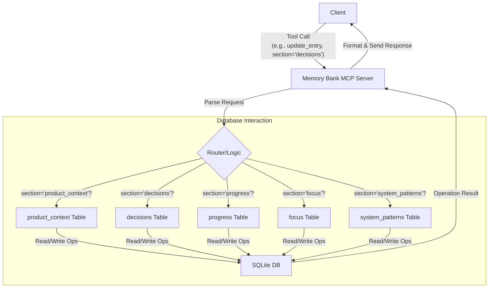

# Memory Bank MCP Server

This is a Model Context Protocol (MCP) server designed to manage project-specific "memory bank" data. It utilizes an SQLite database to store and retrieve contextual information related to a project, such as product background, decision logs, progress updates, etc.

## Features

*   **Project-Based:** Maintains a separate memory bank for each specified project path.
*   **SQLite Storage:** Stores data in a `memory-bank/memory.db` file within the project directory, providing structured and efficient access.
*   **Modular:** Encapsulates memory bank management logic into an independent MCP service.
*   **Standardized Interface:** Provides a set of MCP tools for interacting with the memory bank.

## Running with npx (Recommended)

This server is published to npm and can be run directly using `npx` without manual cloning, installation, or building.

## Running

This server is designed to be automatically started and managed by an MCP-enabled host application (like Roo Code). The host application will run this server based on its configuration (e.g., `mcp_settings.json`).

For manual testing, you can run the compiled file directly after building:

```bash
node build/index.js
```

The server will listen for MCP messages on standard input/output (stdio).

## Integration Guide (Using npx)

You can integrate this Memory Bank MCP Server into MCP-enabled applications (like RooCode). Using `npx` to run the server is recommended.

### RooCode Configuration Example

1.  Open RooCode's `mcp_settings.json` configuration file.
2.  Add a new server configuration entry to the `servers` array as shown below:

    ```json
    {
      "name": "Memory Bank Server (npx)", // You can customize the name
      "command": "npx",
      "args": [
        "-y", // Ensures always using the latest or installed version
        "@your-npm-username/memory-bank-mcp-server" // Replace @your-npm-username with the actual npm username or organization name
        // If the server supports it, add other arguments here, e.g., --config path/to/config.json
      ],
      "type": "stdio", // Or set to "sse" as needed
      "alwaysAllow": [ // List the tools you want to allow this server to use
        "initialize_memory_bank",
        "get_memory_bank_status",
        "read_memory_bank_section",
        "update_memory_bank_entry"
      ],
      "disabled": false // Set to false to enable the server
    }
    ```
3.  **Important:** Replace `@your-npm-username` in `"@your-npm-username/memory-bank-mcp-server"` with the actual npm username or organization name used when publishing this package.
4.  Save the `mcp_settings.json` file.
5.  Restart RooCode to load the new MCP server.

### Other MCP Clients

For other MCP-enabled clients, refer to their documentation on how to configure stdio or SSE type MCP servers launched via the command line. Typically, you will need to provide the `npx` command and corresponding arguments as shown in the example above.

## MCP Tools

The server provides the following MCP tools:

1.  **`initialize_memory_bank`**
    *   **Description:** Initializes the memory bank storage for the specified project path. Creates the `memory-bank/` directory and `memory.db` file if they do not exist.
    *   **Input:**
        *   `project_path` (string, required): The absolute path to the project.
    *   **Output:** An object containing a status message and the database path.

2.  **`get_memory_bank_status`**
    *   **Description:** Checks the status of the memory bank for the specified project path (whether the database file exists).
    *   **Input:**
        *   `project_path` (string, required): The absolute path to the project.
    *   **Output:** An object containing `exists` (boolean), `db_path` (string), and `message` (string).

3.  **`read_memory_bank_section`**
    *   **Description:** Reads entries from a specific section of the memory bank.
    *   **Input:**
        *   `project_path` (string, required): The absolute path to the project.
        *   `section` (string, required): The section to read from (e.g., `product_context`, `decisions`, `progress`, `focus`, `system_patterns`).
        *   `limit` (number, optional, default: 10): Maximum number of entries to return.
        *   `offset` (number, optional, default: 0): Offset for pagination.
    *   **Output:** An array of objects representing the records from that section.

4.  **`update_memory_bank_entry`**
    *   **Description:** Adds a new entry to a specific section of the memory bank.
    *   **Input:**
        *   `project_path` (string, required): The absolute path to the project.
        *   `section` (string, required): The section to update (as above).
        *   `entry_data` (object, required): Data for the new entry. Keys should match the column names of the section's database table (excluding `id` and `timestamp`).
            *   `product_context`: `{ "content": "..." }`
            *   `decisions`: `{ "reason": "...", "outcome": "..." }`
            *   `progress`: `{ "update_summary": "...", "status": "..." }`
            *   `focus`: `{ "area": "...", "details": "..." }`
            *   `system_patterns`: `{ "pattern_name": "...", "description": "..." }`
    *   **Output:** An object containing a status message and the ID of the newly inserted entry.

## How It Works

The following diagram illustrates the basic workflow of the Memory Bank MCP Server:



1.  **Client Request:** The client (e.g., RooCode) initiates a tool call request to the Memory Bank MCP Server, typically including a `section` parameter (e.g., `update_memory_bank_entry` with `section='decisions'`).
2.  **Server Parsing:** The server core receives and parses the request.
3.  **Routing Logic:** The server's internal routing logic determines the target database table based on the `section` parameter in the request.
4.  **Table Interaction:** The request is routed to the appropriate table handling logic (`product_context`, `decisions`, `progress`, `focus`, or `system_patterns`).
5.  **Database Operation:** Read or write operations are performed on the selected table within the SQLite database (`memory-bank/memory.db`).
6.  **Return Results (DB):** The SQLite database returns the result of the operation (e.g., queried data or confirmation of successful insertion).
7.  **Process & Format:** The server core processes the results returned from the database and formats them into an MCP response.
8.  **Send Response:** The server sends the final response back to the client.

### Database Structure

The core of the memory bank consists of the following SQLite tables, which collectively store key project information:

*   **`product_context`**: Stores high-level background information about the product or project, goals, scope, etc. This helps understand the "why" of the project.
*   **`decisions`**: Records important technical choices, architectural decisions, product direction adjustments, etc. Includes the reasons for decisions, options considered, and the final outcome, providing a basis for future review.
*   **`progress`**: Tracks key progress during development, status updates, completed tasks, or milestones. This helps understand "how things are going" with the project.
*   **`focus`**: Defines the current or near-term development focus, key issues to be resolved, or areas requiring special attention. This helps the team stay aligned.
*   **`system_patterns`**: Records reusable patterns, common solutions, or important design principles identified in the codebase or system architecture. This aids knowledge retention and code consistency.

These tables work together to form a dynamic project "memory bank," capturing the project's evolution and key knowledge points.

## Acknowledgements

Parts of the design and inspiration for this project come from the [RooFlow](https://github.com/GreatScottyMac/RooFlow) project. Thanks for the ideas provided for the MCP ecosystem and AI-assisted development workflows.