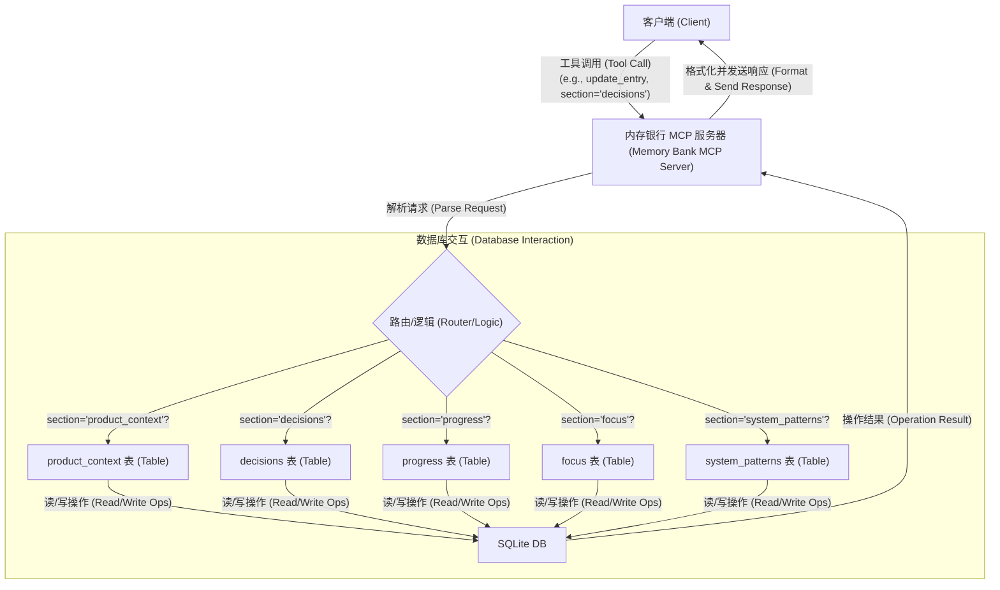

# Memory Bank MCP Server

这是一个 Model Context Protocol (MCP) 服务器，用于管理项目特定的“记忆库”数据。它使用 SQLite 数据库来存储和检索与项目相关的上下文信息，如产品背景、决策日志、进度更新等。

## 功能

*   **基于项目:** 为每个指定的项目路径维护一个独立的记忆库。
*   **SQLite 存储:** 在项目目录下的 `memory-bank/memory.db` 文件中存储数据，提供结构化和高效的访问。
*   **模块化:** 将记忆库管理逻辑封装为独立的 MCP 服务。
*   **标准化接口:** 提供一组 MCP 工具来与记忆库交互。

## 使用 npx 运行 (推荐)

此服务器已发布到 npm，可以通过 `npx` 直接运行，无需手动克隆、安装或构建。

## 运行服务器

运行此服务器的主要方式是使用 `npx`，它会直接从 npm 仓库执行包：

```bash
npx @telagod/memory-bank-mcp-server
```

**Node.js 版本要求:**

*   您需要安装 **Node.js 18.0.0 或更高版本 (`>=18.0.0`)**。

**特定平台的注意事项:**

*   **Windows:** 如果您已正确安装 Node.js v18+ 并将其添加到了系统的 PATH 环境变量中，那么 `npx` 命令应该可以直接在命令提示符 (Command Prompt)、PowerShell 或 Windows Terminal 中工作。

*   **macOS / Linux / WSL (适用于 Linux 的 Windows 子系统):**
    *   **检查您的 Node.js 版本:** 运行 `node -v`。
    *   **潜在问题:** 系统包管理器（如 Ubuntu/Debian 上的 `apt`）提供的默认 Node.js 版本可能已过时（例如 v12.x）。使用旧版本的 Node.js 运行 `npx` 很可能会失败。
    *   **推荐解决方案:** 使用 Node 版本管理器，如 **NVM (Node Version Manager)** 或 **NodeSource** 来安装和管理 Node.js 版本。系统软件仓库通常落后于最新的 Node.js 版本。
    *   **使用 NVM (示例):**
        1.  安装 NVM（请检查 [NVM 官方仓库](https://github.com/nvm-sh/nvm) 以获取最新命令）：
            ```bash
            curl -o- https://raw.githubusercontent.com/nvm-sh/nvm/v0.39.7/install.sh | bash
            ```
        2.  重启您的终端或运行 NVM 安装程序提示的命令。
        3.  安装 Node.js v18+ 版本：`nvm install 18` （或特定版本，如 `nvm install 18.17.0`）
        4.  使用已安装的版本：`nvm use 18`
        5.  现在，`npx @telagod/memory-bank-mcp-server` 命令应该可以正常工作了。

此服务器通常由 MCP 宿主应用程序（如 Roo Code）根据其配置（例如 `mcp_settings.json`）自动启动，但 `npx` 命令是其底层使用的方法。

## 集成指南 (使用 npx)

您可以将此 Memory Bank MCP 服务器集成到支持 MCP 的应用程序（如 RooCode）中。推荐使用 `npx` 来运行服务器。

### RooCode 配置示例

1.  打开 RooCode 的 `mcp_settings.json` 配置文件。
2.  在 `servers` 数组中添加一个新的服务器配置条目，如下所示：

    ```json
    {
      "name": "Memory Bank Server (npx)",
      "command": "npx",
      "args": [
        "-y",
        "@telagod/memory-bank-mcp-server"
      ],
      "type": "stdio",
      "alwaysAllow": [
        "initialize_memory_bank",
        "get_memory_bank_status",
        "read_memory_bank_section",
        "update_memory_bank_entry"
      ],
      "disabled": false
    }
    ```
3.  **重要:** 确保包名 `@telagod/memory-bank-mcp-server` 是正确的。如果您使用的是 fork 或不同版本，请相应更新名称。
4.  **可选参数:** 如果服务器支持额外的命令行参数（例如配置文件路径），您可以将它们作为单独的字符串添加到包名之后的 `args` 数组中。
4.  保存 `mcp_settings.json` 文件。
5.  重启 RooCode 以加载新的 MCP 服务器。

### 其他 MCP 客户端

对于其他支持 MCP 的客户端，请参考其文档，了解如何配置通过命令行启动的 stdio 或 SSE 类型的 MCP 服务器。通常，您需要提供 `npx` 命令和相应的参数，如上例所示。

## MCP 工具

该服务器提供以下 MCP 工具：

1.  **`initialize_memory_bank`**
    *   **描述:** 初始化指定项目路径的记忆库存储。如果 `memory-bank/` 目录或 `memory.db` 文件不存在，则会创建它们。
    *   **输入:**
        *   `project_path` (string, required): 项目的绝对路径。
    *   **输出:** 包含状态消息和数据库路径的对象。

2.  **`get_memory_bank_status`**
    *   **描述:** 检查指定项目路径的记忆库状态（是否存在数据库文件）。
    *   **输入:**
        *   `project_path` (string, required): 项目的绝对路径。
    *   **输出:** 包含 `exists` (boolean), `db_path` (string) 和 `message` (string) 的对象。

3.  **`read_memory_bank_section`**
    *   **描述:** 从记忆库的特定部分读取条目。
    *   **输入:**
        *   `project_path` (string, required): 项目的绝对路径。
        *   `section` (string, required): 要读取的部分 (例如, `product_context`, `decisions`, `progress`, `focus`, `system_patterns`)。
        *   `limit` (number, optional, default: 10): 返回的最大条目数。
        *   `offset` (number, optional, default: 0): 用于分页的偏移量。
    *   **输出:** 一个包含该部分记录的对象数组。

4.  **`update_memory_bank_entry`**
    *   **描述:** 在记忆库的特定部分添加一个新条目。
    *   **输入:**
        *   `project_path` (string, required): 项目的绝对路径。
        *   `section` (string, required): 要更新的部分 (同上)。
        *   `entry_data` (object, required): 新条目的数据。键应与该部分数据库表的列名匹配（`id` 和 `timestamp` 除外）。
            *   `product_context`: `{ "content": "..." }`
            *   `decisions`: `{ "reason": "...", "outcome": "..." }`
            *   `progress`: `{ "update_summary": "...", "status": "..." }`
            *   `focus`: `{ "area": "...", "details": "..." }`
            *   `system_patterns`: `{ "pattern_name": "...", "description": "..." }`
    *   **输出:** 包含状态消息和新插入条目 ID 的对象。

## 工作原理

下图展示了 Memory Bank MCP 服务器的基本工作流程：



1.  **客户端请求:** 客户端（如 RooCode）向内存银行 MCP 服务器发起工具调用请求，通常包含 `section` 参数（例如，`update_memory_bank_entry` with `section='decisions'`）。
2.  **服务器解析:** 服务器核心接收并解析请求。
3.  **路由逻辑:** 服务器内部的路由逻辑根据请求中的 `section` 参数确定目标数据库表。
4.  **表交互:** 请求被路由到相应的表处理逻辑（`product_context`, `decisions`, `progress`, `focus`, 或 `system_patterns`）。
5.  **数据库操作:** 针对选定的表，在 SQLite 数据库 (`memory-bank/memory.db`) 中执行读或写操作。
6.  **返回结果 (DB):** SQLite 数据库返回操作结果（例如，查询到的数据或插入成功的确认）。
7.  **处理与格式化:** 服务器核心处理数据库返回的结果，并将其格式化为 MCP 响应。
8.  **发送响应:** 服务器将最终的响应发送回客户端。

### 数据库结构 (Database Structure)

记忆库的核心由以下 SQLite 表构成，它们共同存储项目的关键信息：

*   **`product_context`**: 存储关于产品或项目的高级背景信息、目标、范围等。这有助于理解项目的“为什么”。
*   **`decisions`**: 记录重要的技术选型、架构决策、产品方向调整等。包含做出决策的原因、考虑的选项以及最终结果，为未来的回顾提供依据。
*   **`progress`**: 跟踪开发过程中的关键进展、状态更新、已完成的任务或里程碑。这有助于了解项目的“怎么样了”。
*   **`focus`**: 定义当前或近期的开发重点、需要解决的关键问题或需要特别关注的领域。这有助于团队保持方向一致。
*   **`system_patterns`**: 记录在代码库或系统架构中识别出的可重用模式、常见解决方案或重要的设计原则。这有助于知识沉淀和代码一致性。

这些表共同协作，形成了一个动态的项目“记忆库”，捕捉了项目的演变过程和关键知识点。

## 致谢 (Acknowledgements)

此项目的部分设计和灵感来源于 [RooFlow](https://github.com/GreatScottyMac/RooFlow) 项目。感谢其为 MCP 生态和 AI 辅助开发流程提供的思路。
